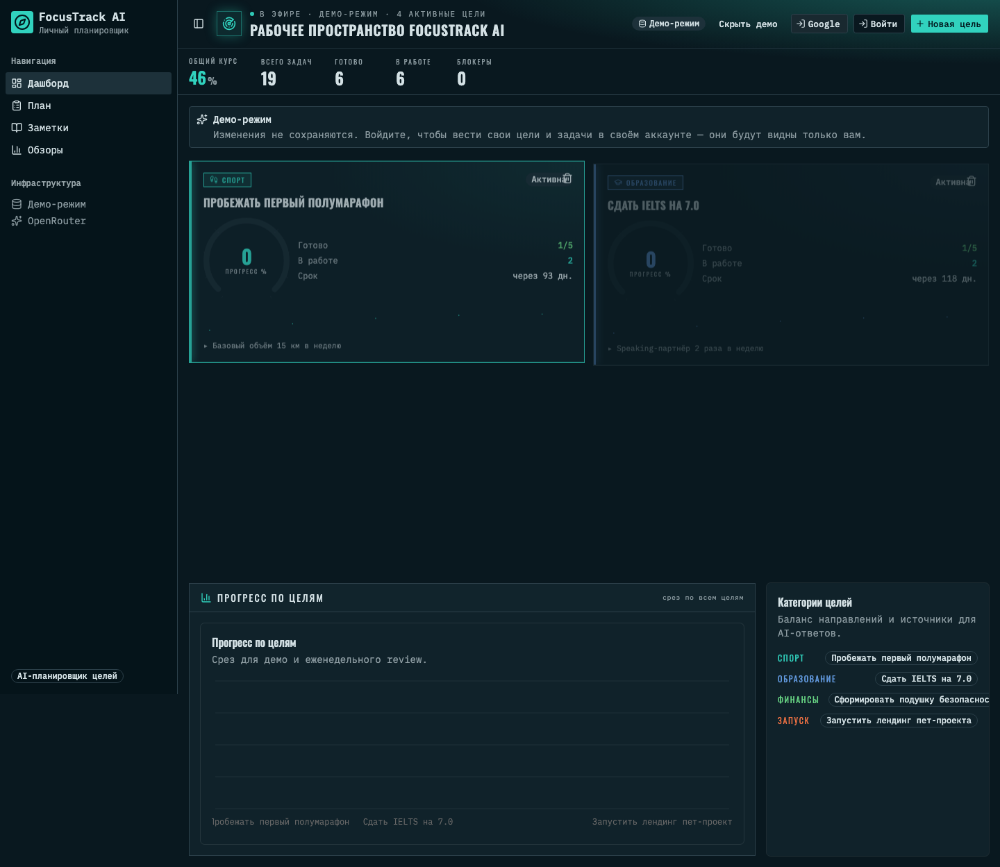
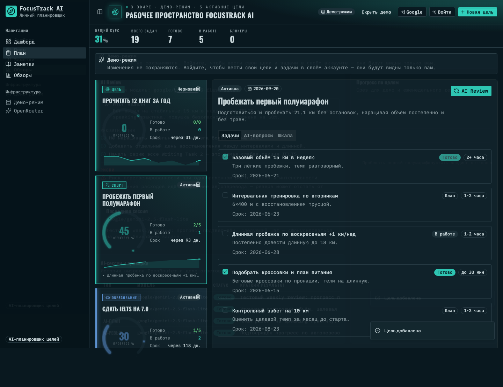
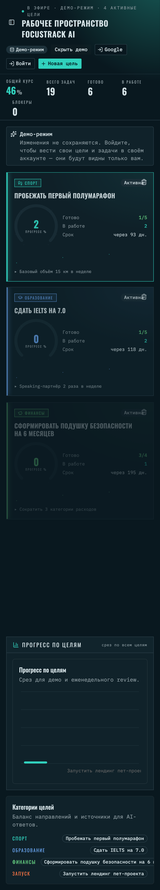

# FocusTrack AI

**FocusTrack AI** — fullstack-продукт для отслеживания личных и рабочих целей с AI-планировщиком.

Продукт помогает сформулировать цель, уточнить её через AI-вопросы, разложить на этапы и задачи, отслеживать прогресс и получать еженедельный AI-обзор по фактическим данным.

## Статус

Продукт доведён до работающего MVP: есть shadcn frontend, Supabase schema/RLS, Edge Functions для OpenRouter, CI quality gate, Vercel production deploy, Playwright e2e, скриншоты и видео основного сценария.

Production URL: https://focustrack-ai.vercel.app

## Демо-цели

Демо показывает четыре жизненные цели, на которых удобно увидеть весь рабочий контур:

1. Пробежать первый полумарафон.
2. Сдать IELTS на 7.0.
3. Сформировать подушку безопасности на 6 месяцев.
4. Запустить лендинг пет-проекта.

## Возможности MVP

1. SMART-вход цели с AI-уточнением.
2. AI-декомпозиция цели в этапы и задачи.
3. Дашборд прогресса: цели, задачи, процент выполнения, серия выполненных дней.
4. Weekly AI Review по фактическим данным за неделю.
5. Ответы по личным заметкам пользователя (RAG-эксперимент).

## Стек

| Слой                | Технологии                                             |
| ------------------- | ------------------------------------------------------ |
| Frontend            | React, TypeScript, Vite, shadcn/ui, Tailwind, Recharts |
| Backend / DB / Auth | Supabase Cloud, PostgreSQL, Auth, RLS                  |
| AI-слой             | Supabase Edge Functions, OpenRouter                    |
| Production deploy   | Vercel                                                 |
| Тестирование        | Vitest, Playwright                                     |
| Разработка          | git, GitHub Actions                                    |

## Дорожная карта

Публичная дорожная карта продукта находится в [ROADMAP.md](./ROADMAP.md).

Коротко:

1. **Product specification** — описание продукта, user stories, техническая спецификация и ADR.
2. **Frontend MVP** — интерфейс, дашборд, состояние и пользовательские сценарии.
3. **Backend and AI functions** — Supabase, RLS, Edge Functions, OpenRouter.
4. **Knowledge/RAG** — ответы по личным заметкам пользователя.
5. **Production** — CI/CD, OAuth, аналитика, безопасность и Vercel deploy.

## Запуск

Проект использует облачный backend: PostgreSQL, Auth, RLS и Edge Functions работают в Supabase Cloud,
а локально поднимается только frontend. Поэтому вместо `docker compose` в репозитории есть `start.sh`.

Что делает `start.sh`:

1. проверяет наличие `node` и `pnpm`;
2. если `node_modules` отсутствует, запускает `pnpm install --frozen-lockfile`;
3. проверяет production frontend `https://focustrack-ai.vercel.app`;
4. проверяет Supabase health endpoint `/functions/v1/health`;
5. если проверки успешны, запускает локальный Vite frontend на `http://127.0.0.1:5173`.

Режим `FOCUSTRACK_CHECK_ONLY=1` выполняет только проверки и завершает скрипт без запуска dev-сервера.

Одна команда для проверки и локального запуска:

```bash
./start.sh
```

Быстрая проверка без запуска dev-сервера:

```bash
FOCUSTRACK_CHECK_ONLY=1 ./start.sh
```

Ручной эквивалент:

```bash
pnpm install
pnpm dev
```

Проверка:

```bash
pnpm run lint
pnpm run typecheck
pnpm run test
pnpm run build
pnpm run test:e2e
```

## Скриншоты

Снимки актуального интерфейса (Mission Control), сгенерированные Playwright-прогоном демо-сценария:







## Документация

| Раздел                                                                                             | Содержание                                        |
| -------------------------------------------------------------------------------------------------- | ------------------------------------------------- |
| [docs/product/](./docs/product/)                                                                   | Описание продукта, UI-концепции, user stories, ТЗ |
| [docs/product/demo_walkthrough.md](./docs/product/demo_walkthrough.md)                             | 10-минутный сценарий демонстрации продукта        |
| [docs/backend/backend_architecture.md](./docs/backend/backend_architecture.md)                     | Архитектура backend-а и AI-функций                |
| [docs/backend/backend_documentation.md](./docs/backend/backend_documentation.md)                   | Backend-документация                              |
| [docs/frontend/development_report.md](./docs/frontend/development_report.md)                       | Отчёт по frontend                                 |
| [docs/integrations/integration_documentation.md](./docs/integrations/integration_documentation.md) | CI/CD и интеграции                                |
| [docs/production-deployment.md](./docs/production-deployment.md)                                   | Vercel production deployment                      |
| [docs/security/security_audit.md](./docs/security/security_audit.md)                               | Аудит безопасности                                |
| [DEMO_ACCESS.md](./DEMO_ACCESS.md)                                                                 | Публичный демо-доступ для проверки                |
| [AGENTS.md](./AGENTS.md)                                                                           | Проектные инструкции для AI-агента                |
