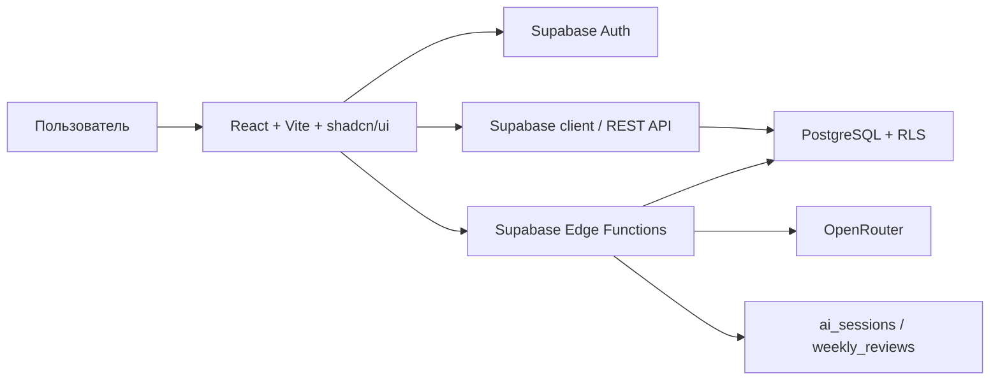

# Архитектура FocusTrack AI

FocusTrack AI построен как Supabase-first fullstack-приложение: frontend работает с пользовательским интерфейсом и сессией, а все операции с секретами и AI выполняются на стороне Supabase Edge Functions.

## Компоненты

| Компонент | Ответственность |
| --- | --- |
| `src/App.tsx` | Основной пользовательский сценарий: цель, задачи, прогресс, weekly review |
| `src/lib/focustrack-api.ts` | Клиентский слой для Supabase и fallback demo-логики |
| `src/lib/supabase.ts` | Инициализация Supabase client с publishable key |
| `supabase/migrations/` | Таблицы, индексы, RLS policies и grants |
| `supabase/functions/ai-clarify` | Уточняющие вопросы по цели |
| `supabase/functions/ai-plan` | Генерация плана задач |
| `supabase/functions/ai-weekly-review` | Weekly AI Review по фактическому прогрессу |
| `supabase/functions/rag-answer` | RAG-ответ по подготовленным документам |
| `supabase/functions/health` | Публичный health-check для мониторинга |

## Поток данных

1. Пользователь работает во frontend и авторизуется через Supabase Auth.
2. CRUD-данные читаются и изменяются через Supabase client.
3. Row Level Security ограничивает доступ строками текущего пользователя.
4. AI-сценарии вызываются через Edge Functions с пользовательским JWT.
5. Edge Function получает `OPENROUTER_API_KEY` и `OPENROUTER_MODEL` из Supabase secrets.
6. Ответ модели сохраняется в продуктовые таблицы и возвращается во frontend.

## Безопасность

- OpenRouter не вызывается из браузера напрямую.
- Service role key не используется во frontend.
- В git хранится только `.env.example`; реальные значения живут в локальном `.env.local` и Supabase secrets.
- AI/RAG Edge Functions защищены `verify_jwt=true`.
- Публичной оставлена только функция `health`.
- Для продуктовых таблиц включены RLS policies и ограничены grants для `anon`.

## Связанные документы

- [`docs/architecture/adr/001-tech-stack.md`](adr/001-tech-stack.md)
- [`docs/backend/backend_architecture.md`](../backend/backend_architecture.md)
- [`docs/backend/backend_documentation.md`](../backend/backend_documentation.md)
- [`docs/security/security_audit.md`](../security/security_audit.md)
