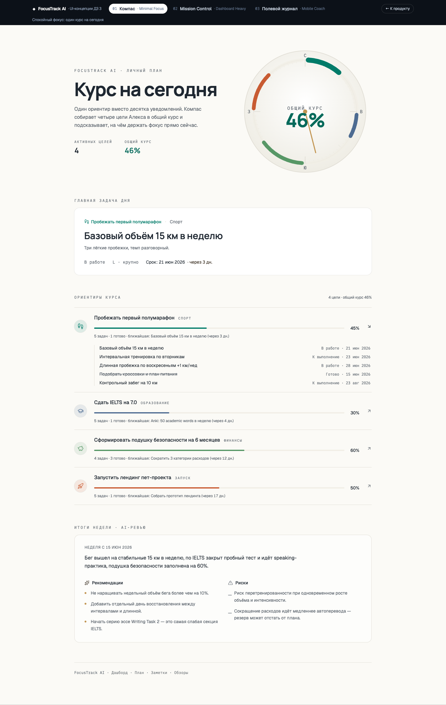
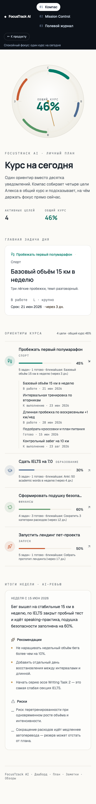
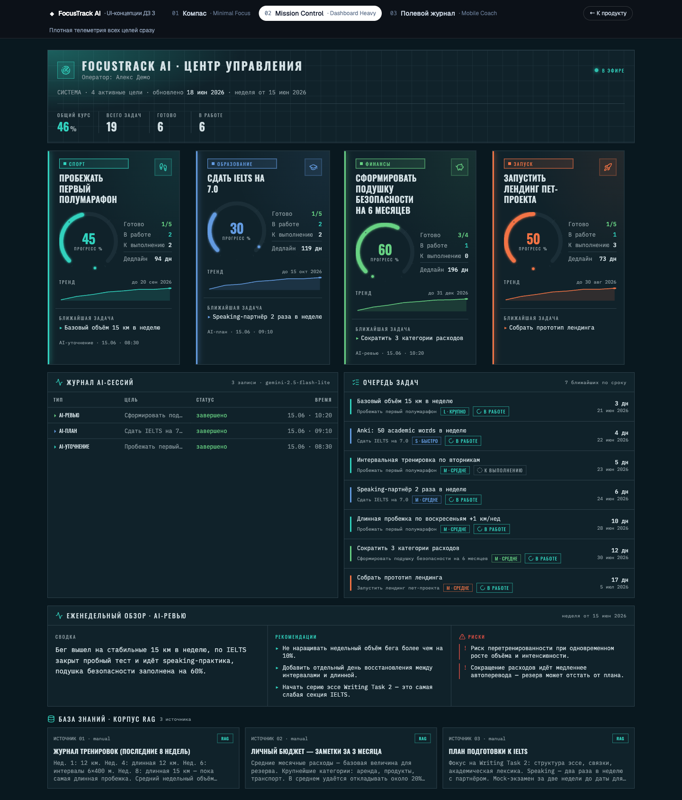
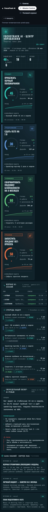
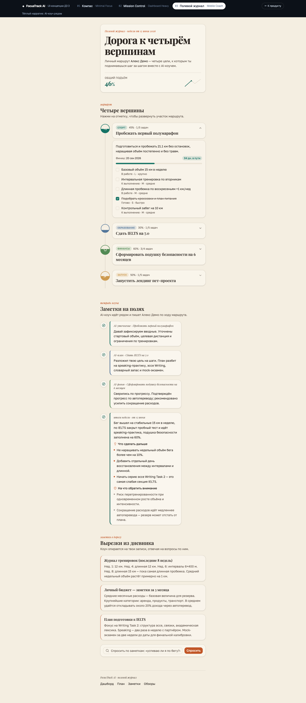
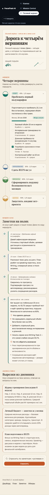

# UI-концепции FocusTrack AI

## Метод

Сформулированы три различных по **стилю и компоновке** концепции интерфейса
FocusTrack AI и реализованы как **живые интерактивные прототипы** в самом
React-приложении (а не статичные мокапы). Все три рендерят один и тот же
реальный демо-контент (персона «Алекс Демо», 4 цели, задачи, AI-сессии,
еженедельный обзор, заметки для RAG), поэтому отличаются именно дизайном, а не
данными. Это позволяет честно сравнить направления на одном содержании и
выбрать рабочий экран, а не красивую витрину.

Каждая концепция вынесена в отдельную тему (scope-класс с переопределением
CSS-токенов и шрифтов), переиспользует те же примитивы shadcn/ui, что и продукт,
и обладает собственным сигнатурным элементом.

## Как посмотреть вживую

- Витрина концепций: маршрут **`/concepts`** (переключатель сверху:
  `/concepts/compass`, `/concepts/mission`, `/concepts/journal`).
- Локально: `pnpm dev`, затем открыть `http://localhost:5173/concepts`.
- Код: `src/features/concepts/` (общий адаптер данных `concept-data.ts`, темы
  `concepts.css`, оболочка `concepts-showcase.tsx`, по папке на концепцию).
- Витрина подключена аддитивно (ленивый чанк, отдельный от дашборда) и не влияет
  на продакшн-экран и e2e-тесты.

---

## Концепция 1 — «Компас» (Compass / Minimal Focus)

**Тезис:** спокойный фокус — «один курс на сегодня» вместо десятка уведомлений.

**Стиль:** светлый, тёплый near-white фон, глубокий бирюзовый primary, сдержанный
латунный акцент, мягкие скругления. Дисплейный шрифт Manrope, табличные цифры.
Минимализм, исполненный точно (воздух, выравнивание, типографическая шкала).

**Компоновка:** центрированная одноколоночная структура — hero «Курс на сегодня»
рядом с сигнатурой, затем «Главная задача дня», тихий список целей-ориентиров с
раскрытием задач и одна понятная панель «Итоги недели · AI-ревью».

**Сигнатура:** круговой **компас-циферблат** — каждая из 4 целей занимает свой
90°-квадрант, цветная дуга (по токену цели) заполняет квадрант на процент
прогресса; в центре — общий курс 46%, латунная стрелка-needle. Дуги
прорисовываются при загрузке (отключается при `prefers-reduced-motion`).

**Плюсы:**

- минимальное когнитивное усилие, удобно для ежедневного использования;
- сразу виден один приоритет и общий курс;
- легко адаптируется под мобильный экран.

**Минусы:**

- меньшая аналитическая плотность — статус всех целей сразу виден хуже;
- история AI-сессий вынесена за пределы первого экрана.

---

## Концепция 2 — «Mission Control» (Dashboard Heavy)

**Тезис:** центр управления — вся телеметрия всех целей видна сразу, как на
навигационной приборной панели (перекликается с компасом бренда).

**Стиль:** тёмная **полихромная** приборная панель (а не «один кислотный
акцент»): полуночно-бирюзовый фон, каждая цель сохраняет свой оттенок из палитры
графиков, тонкая сетка, светящиеся дуги, моноширинные ридауты (IBM Plex Mono),
конденсированные заголовки Oswald, острые углы.

**Компоновка:** плотная bento-сетка — верхний баннер «Центр управления» с
агрегатами, 4 телеметрийных тайла целей, журнал AI-сессий, очередь задач,
mission-log еженедельного обзора и полоса корпуса RAG.

**Сигнатура:** **телеметрийные тайлы** — на каждую цель радиальный gauge с
glow-эффектом (цвет по цели) + трендовый спарклайн + счётчики задач, выровненные
по точной сетке. Дуги «выметаются» при загрузке (учитывает reduced-motion).

**Плюсы:**

- статус всех целей и backend-артефактов виден целиком за один взгляд;
- удобно демонстрировать продукт и его данные на защите;
- богатая аналитическая плотность (gauge, спарклайны, таблицы, лог).

**Минусы:**

- выше риск перегрузить первый экран;
- требует аккуратной адаптивной сетки (на мобильном тайлы стекаются в колонку);
- тёмная тема и моноширинный текст — не для всех ежедневных сценариев.

---

## Концепция 3 — «Полевой журнал» (Mobile Coach)

**Тезис:** тёплый нарративный спутник — полевой журнал экспедиции и AI-коуч,
который идёт рядом. Персональный и разговорный, не дашборд.

**Стиль:** тёплая песочная палитра, бирюзовые «чернила», глиняный акцент только
на CTA; контрастный editorial-serif Playfair Display в заголовках, гуманистичный
Golos Text в тексте. От клише «крем + serif + терракота» уводит метафора тропы и
подъёма.

**Компоновка:** mobile-first одна колонка по центру — «обложка журнала», маршрут
из вейпоинтов, тред коуча, выписки-заметки, RAG-инпут; на десктопе колонка
остаётся узкой, поля заполняет фоновый рельеф.

**Сигнатуры (три):**

- **топографический рельеф** — контурные линии-фон (метафора набора высоты);
- **маршрут «Четыре вершины»** — вертикальный таймлайн целей-вейпоинтов с
  раскрытием описания, срока (`daysUntil`), прогресса и чек-листа задач;
- **тетрадь коуча** — чат-тред: каждая реальная AI-сессия и еженедельный обзор
  превращаются в тёплые сообщения коуча (рекомендации → «что сделать дальше»,
  риски → «на что обратить внимание»).

**Плюсы:**

- лучший сценарий для ежедневного мобильного использования и push-уведомлений;
- эмоциональная вовлечённость через голос коуча и нарратив пути;
- AI-результаты подаются человечно, а не как сухие таблицы.

**Минусы:**

- хуже подходит для демонстрации всей архитектуры и нескольких целей сразу;
- одноколоночный формат недоиспользует широкий экран;
- editorial-serif требует аккуратной типографики, чтобы не «уплыть» в декор.

---

## Сравнение

| Критерий | Компас | Mission Control | Полевой журнал |
| --- | --- | --- | --- |
| Стиль | светлый, спокойный | тёмный, приборный | тёплый, нарративный |
| Палитра | бирюза + латунь на near-white | полихром на полуночном фоне | песок + бирюза + глина |
| Компоновка | один фокус, центр | плотный bento | линейный таймлайн, mobile-first |
| Плотность данных | низкая | высокая | средняя |
| Сигнатура | компас-циферблат | телеметрийные gauge-тайлы | рельеф + маршрут + тред коуча |
| Лучший сценарий | ежедневный фокус | обзор/демо всего | мобильный коучинг |

## Выбор

Для MVP выбрана **гибридная** концепция **Dashboard Heavy + Minimal Focus**
(Mission Control × Компас):

- навигация и инфраструктурный статус (как в Mission Control) дают полный обзор
  целей, задач и AI-сессий;
- центральная зона остаётся сфокусированной на выбранной цели (как в «Компасе»),
  чтобы экран не превращался в стену метрик;
- мобильный viewport сохраняет основной контент и кнопку создания цели;
- идеи «Полевого журнала» (человечная подача AI-результатов, прогресс как путь)
  зарезервированы для последующих итераций мобильного опыта и уведомлений.

Обоснование: продукт должен быть рабочим инструментом ведения целей, а не
лендингом или только мобильным дневником. Гибрид сочетает обзорность и фокус и
лучше всего соответствует основным пользовательским сценариям.

## Реализация

- Прототипы концепций: `src/features/concepts/` (маршрут `/concepts`).
- Выбранная (рабочая) концепция: `src/features/dashboard/focustrack-dashboard.tsx`.
- Общие примитивы: `src/components/ui/*` (shadcn/ui).
- Демонстрационные данные: `src/lib/demo-data.ts` (через `concept-data.ts`).
- Визуальные артефакты концепций: `docs/product/ui_concepts/media/`
  (дубль — `submissions/hw3/evidence/media/`).
- Скриншоты выбранного дашборда: `submissions/hw3/evidence/media/dashboard-*.png`.
